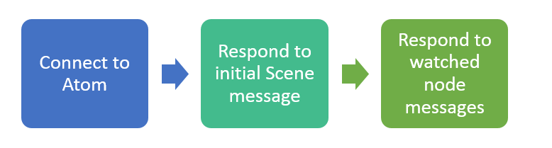

# Atom Developer Documentation

Welcome to Atom's Developer Documentation.  This guide will get you up and running for creation of a client to interact with Atom.  We strongly recommend looking at the accompanying C# client implementation for a detailed example of how client interaction works.   Good luck!

*This documentation was last updated: July 29 2016.*

---

## Table of Contents
1. [Introduction](#intro)
2. [Setting Up Your Environment](#setup_env)
3. [Connecting to Atom](#connecting_atom)
4. [Receiving Messages](#recv_msg)
5. [Responding to Messages](#resp_msg)
6. [Watching and Unwatching Nodes](#watch_unwatch)
7. [Example Workflow](#example_workflow)
8. [Listing of All Messages](#all_msg)

---

## <a id="intro"></a>Introduction
Atom is based on a similar system to Maya.  There are raw data nodes, which represent shapes, such as meshes, camera, lights, and so on, and there are transform nodes, that act as parents to shape nodes.

Atom is developed such that transform nodes can be completely ignored, and each shape node can be individually used.  For instance, *Mesh* nodes contain a world matrix that can be used to place its local space vertices into world space.  This works fine, but without using the transform nodes, features such as instancing do not exist.  In other words, all shape nodes contain a standalone world matrix (or equivalent) intended to be used without the parent transforms.  If multiple instances of the shape node exist, the first matrix is taken.

Ideally, shape nodes should be treat as data only, and the transforms should reference the data accordingly.  As an example, a transform may contain a mesh shape node.  The mesh shape node would contain the geometric data in local space, whereas the transform node would tell the referenced mesh where to be placed in world space.

All nodes are named, and these names are used to update nodes when they change.  It is up to you how you identify the nodes based on the given ID from Atom.  For example, the name could be used directly, or hashed.  What is important is that you can locate existing nodes by a given name.

---

## <a id="setup_env"></a>Setting Up Your Environment
Atom makes extensive use of Google's [Protocol Buffers](https://developers.google.com/protocol-buffers/) library.  Specifically, Atom uses version [3.0.0-beta-2](https://github.com/google/protobuf/releases/tag/v3.0.0-beta-2).  Your client must use one of the many languages that Protocol Buffers supports.

You must link the Protocol Buffer dependencies into your project.  Follow Google's tutorial for your chosen language for this.  A number of library binaries are provided by Google, but some may require building.

Once done, add the compiled Protocol Buffers files for your language to your project accordingly.  Feel free to rebuild them from the .proto source, but **do not** modify them.  Ensure that your project is able to build with the files added before continuing.

You are now ready to interact with Atom.

---

## <a id="connecting_atom"></a>Connecting to Atom
Atom uses TCP for communications to ensure data integrity.  Connecting to Atom is the same as connecting to any other server.  Make a TCP client and connect to with the IP address and port of the host machine running Atom.  This can be a local connection on the same computer, too.

---

## <a id="recv_msg"></a>Receiving Messages
Messages from Atom are stored in the format of a header followed by a Protocol Buffer message in the form of raw bytes.  The header is a packed integer representing the size in bytes of the following Protocol Buffer data.

The first **four bytes** of any given message are the header.  These are written using **little endian**.  When these bytes are read, they can be unpacked to form a 32-bit signed integer.  For example, in C#:

```csharp
// where readBuffer contains the first four bytes
int dataSize = BitConverter.ToInt32(readBuffer, 0);
```

After unpacking the size of the remaining data, read it all into a **separate** buffer.  The remaining Protocol Buffer data will always be of type **AtomMessage**, and after all data has been read, can safely be parsed.  In C#, it looks something like this:

```csharp
// where readBuffer contains only the Protocol Buffer bytes, without the header
Atom.Proto.AtomMessage msg = Atom.Proto.AtomMessage.Parser.ParseFrom(readBuffer);
```

You are then free to respond to the message as fit.  See the [Listing of All Messages](#all_msg) below for more information on how to handle the message data.

---

## <a id="resp_msg"></a>Responding to Messages
When responding to Atom messages, your data should be in a single buffer, in the same form as is received: a header followed by data.  The header must be a 32-bit signed integer packed into **four bytes** using **little endian** ordering.  This integer must be the size in bytes of the data following.  The data following is interpreted in Atom as a string of characters.  Here is an example of how to do this in C#:

```csharp
// where Data is a variable somewhere, and userDataSize is the size of userData in bytes
void build_message( byte[] userData, Int32 userDataSize ) {
	Data = new MemoryStream();
	byte[] header = BitConverter.GetBytes(userDataSize);
	Data.Write(header, 0, HEADER_SIZE);
	Data.Write(userData, 0, userDataSize);
}
```

---

## <a id="watch_unwatch"></a>Watching and Unwatching Nodes
When you connect to Atom, you will be sent a *Scene* message containing a proxy of the current scene in the form of node types and names.  It is your job to decide which nodes you would like Atom to send to you.

To register your client to receive node information, use the **watch** command.  Its syntax is: **watch node_name;**.  For example:
```
watch pCubeShape1;
```

If at any time you want to stop receiving node information, you can use the **unwatch** command.  Its syntax is: **unwatch node_name;**.  For example:
```
unwatch pCubeShape1;
```

Both of these commands should be sent to the server as described in [Responding to Messages](#resp_msg).

---

## <a id="example_workflow"></a>Example Workflow
This section will briefly describe an example workflow based on the accompanying C# client.  As seen in the figure below, the interaction with Atom can be broken up into three major parts.



The first stage involves connecting to Atom using a TCP client.  The correct port and hostname should be confirmed before attempting to connect.  If Atom detects issues with the connection, it may terminate it.

After a connection has been established, Atom will send an *AtomMessage* with the *Scene* set.  This is a proxy representation of the scene, with only node types and names being sent.  At this stage, your job is to decide which nodes you would like to receive information for.  Atom expects you to send the **watch** command for each node you want to register interest in.  Providing the command is sent correctly and the given node can be found, Atom will set up a link to automatically propagate changes of the given note to your client.  It is worth mentioning that the *Scene* message can be sent for other purposes too, and you are able to likewise respond at any of those stages.  See the [Scene](#msg_scene) message for more information.

After you have told Atom which nodes you want to listen to with the **watch** command, you should handle all of the [other related messages](#all_msg) accordingly.  If at any point you want to stop receiving information about a node, just use the aforementioned **unwatch** command.

When the connection is terminate either from Atom or from your client, all links will be broken, and the client is free to reconnect.

---

## <a id="all_msg"></a>Listing of All Messages
Every incoming message from Atom will have Protocol Buffer data of type **AtomMessage**.  This message acts as a container for all possible messages Atom sends.  Each will be discussed below.

* Data Classes
	* [Vector2](#msg_vector2)
	* [Vector3](#msg_vector3)
	* [Color](#msg_color)
	* [Matrix](#msg_matrix)
	* [Vertex](#msg_vertex)
* Lights
	* [LightType](#msg_light_type)
	* [Light](#msg_light)
	* [LightChanged](#msg_light_changed)
* Meshes
	* [Mesh](#msg_mesh)
	* [MeshGeometryChanged](#msg_mesh_geometry_changed)
	* [MeshPointsChanged](#msg_mesh_points_changed)
	* [MeshMaterialChanged](#msg_mesh_material_changed)
* Materials and Textures
	* [TextureData](#msg_texture_data)
	* [Texture](#msg_texture)
	* [TextureChanged](#msg_texture_changed)
	* [MaterialType](#msg_material_type)
	* [TexturedParameter](#msg_textured_parameter)
	* [Material](#msg_material)
	* [Lambert](#msg_lambert)
	* [Blinn](#msg_blinn)
	* [Phong](#msg_phong)
	* [PhongE](#msg_phonge)
	* [Anisotropic](#msg_anisotropic)
	* [MaterialChanged](#msg_material_changed)
* Other Shapes
	* [Annotation](#msg_annotation)
	* [Camera](#msg_camera)
	* [Curve](#msg_curve)
* Other Classes
	* [Scene.Reason](#msg_scene_reason)
	* [SceneObject](#msg_scene_object)
	* [Scene](#msg_scene)
	* [Component.ComponentType](#msg_component_type)
	* [Component](#msg_component)
	* [Transform](#msg_xform)
	* [MatrixChanged](#msg_matrix_changed)
	* [NameChanged](#msg_name_changed)
	* [VisibilityChanged](#msg_visibility_changed)

#### *AtomMessage*
A generic container for all other message types.
Contains every potential message Atom will send.  Uses Protocol Buffer's **oneof** feature, so only one will be set at a time.  The actual set message can be detected using a switch statement.  For instance, in C#:
```csharp
switch( msg.MsgCase ) {
  case Atom.Proto.AtomMessage.MsgOneofCase.Camera: {
    // handle camera
    break;
  }
  // handle other types
}
```

#### <a id="msg_vector2"></a> *Vector2* [&#8593;](#all_msg)
Floating point 2D vector.

| Variable | Type  | Description |
| ---      | ---   | ---         |
| x        | float | X component |
| y        | float | Y component |

#### <a id="msg_vector3"></a> *Vector3* [&#8593;](#all_msg)
Floating point 3D vector.

| Variable | Type  | Description |
| ---      | ---   | ---         |
| x        | float | X component |
| y        | float | Y component |
| z        | float | Z component |

#### <a id="msg_color"></a> *Color* [&#8593;](#all_msg)
Floating point RGBA color.

| Variable | Type   | Description     |
| ---      | ---    | ---             |
| r        | float  | Red channel     |
| g        | float  | Green channel   |
| b        | float  | Blue channel    |
| a        | float  | Alpha channel   |

#### <a id="msg_matrix"></a> *Matrix* [&#8593;](#all_msg)
Floating point matrix.  Almost always 4x4 world matrix.

| Variable | Type    | Description                              |
| ---      | ---     | ---                                      |
| Rows     | uint32  | Number of rows (usually 4)               |
| Cols     | uint32  | Number of columns (usually 4)            |
| M        | float[] | Array of floats, with Rows*Cols elements |

#### <a id="msg_vertex"></a> *Vertex* [&#8593;](#all_msg)
Full-fat vertex structure.  Lists contain one element per UV/color set respectively.

| Variable | Type          | Description             |
| ---      | ---           | ---                     |
| Index    | int32         | Vertex physical index   |
| Position | Vector3       | Vertex position         |
| Normal   | Vector3       | Vertex normal           |
| Texcoord | List<Vector2> | One texcoord per UV set |
| Tangent  | List<Vector3> | One tangent per UV set  |
| Binormal | List<Vector3> | One binormal per UV set |
| Color    | List<Color>   | One color per color set |

#### <a id="msg_light_type"></a> *LightType* [&#8593;](#all_msg)
Used in the *Light* message to determine the type of the light source.

| Enumeration           | Description            |
| ---                   | ---                    |
| kLightTypeAmbient     | Is an ambient light    |
| kLightTypeDirectional | Is a directional light |
| kLightTypeSpot        | Is a spot light        |
| kLightTypePoint       | Is a point light       |


#### <a id="msg_light"></a> *Light* [&#8593;](#all_msg)
Represents all supported types of MFn::kLight and derivations.  All light types share this one class.  The type of light source can be determined with *Type*.  *Position* and *Direction* are provided to use a light without a parent *Transform*.

| Variable          | Type      | Description                               |
| ---               | ---       | ---                                       |
| Name              | string    | Name of the node                          |
| Type              | LightType | Type of light source                      |
| Position          | Vector3   | World space position (point, spot)        |
| Direction         | Vector3   | World space direction (directional, spot) |
| Range             | float     | Light range (point: radius, spot: height) |
| Color             | Color     | Light color                               |
| Intensity         | float     | Light intensity                           |
| ConeAngle         | float     | Interior cone angle in degrees (spot)     |
| PenumbraAngle     | float     | Penumbra angle in degrees (spot)          |
| Dropoff           | float     | Light dropoff (spot)                      |
| Shadows           | bool      | Whether shadows are enabled or not        |
| ShadowResolution  | int32     | Shadow map resolution                     |
| ShadowBias        | float     | Shadow bias                               |
| ShadowColor       | Color     | Shadow color                              |
| InitialVisibility | bool      | Initial visibility                        |

#### <a id="msg_light_changed"></a> *LightChanged* [&#8593;](#all_msg)
This message is sent when an existing *Light* node changes one of its properties, such as the color changing.  The *LightName* states which light, by name, changed.  All possible light parameters are included.  Only a single parameter will be valid.  The set parameter can be determined with the *PropertyCase* enumeration.

| Variable     | Type   | Description                            |
| ---          | ---    | ---                                    |
| LightName    | string | Name of the light node that changed    |
| PropertyCase | oneof  | Enumeration for which property changed |

#### <a id="msg_mesh"></a> *Mesh* [&#8593;](#all_msg)
These nodes represent nodes of type MFn::kMesh.  The data is already prepared into an indexed triangle list.  Both *Vertices* and *Indices* can be placed into respective buffers and drawn accordingly.  The *MaterialName* can be used to look up an assigned *Material* node.  To use the node without a parent *Transform*, the world matrix is also included.

| Variable          | Type         | Description                   |
| ---               | ---          | ---                           |
| Name              | string       | Name of the node              |
| Vertices          | List<Vertex> | List of vertices              |
| Indices           | List<int32>  | List of indices               |
| TexcoordSetNames  | List<string> | List of UV set names          |
| MaterialName      | string       | Assigned *Material* node name |
| World             | Matrix       | World matrix                  |
| InitialVisibility | bool         | Initial visibility            |

#### <a id="msg_mesh_geometry_changed"></a> *MeshGeometryChanged* [&#8593;](#all_msg)
This message is sent when an existing *Mesh* node's geometry is destructively changed, i.e. the number of vertices or indices is modified.  The new *Vertices* and *Indicies* lists should directly replace previous geometry.

| Variable | Type         | Description                        |
| ---      | ---          | ---                                |
| MeshName | string       | Name of the mesh node that changed |
| Vertices | List<Vertex> | List of new vertices               |
| Indices  | List<int32>  | List of new indices                |

#### <a id="msg_mesh_points_changed"></a> *MeshPointsChanged* [&#8593;](#all_msg)
This message is sent when an existing *Mesh* node's vertices are modified in a non-destructive way, i.e. data, such as position, are changed in place without changing the number or order of vertices.  Each modified *Vertex* can be matched with their *Index* parameter.  For instance, if only vertex 42 was modified, the single element in *Vertices* would have its *Index* property set to 42.

| Variable | Type         | Description                        |
| ---      | ---          | ---                                |
| MeshName | string       | Name of the mesh node that changed |
| Vertices | List<Vertex> | List of changed vertices           |

#### <a id="msg_mesh_material_changed"></a> *MeshMaterialChanged* [&#8593;](#all_msg)
This message is sent when an existing *Mesh* node has its material changed.  The new *Material* node can be looked up by the provided *MaterialName* parameter.

| Variable     | Type   | Description                         |
| ---          | ---    | ---                                 |
| MeshName     | string | Name of the mesh node that changed  |
| MaterialName | string | Name of the new assigned *Material* |

#### <a id="msg_texture_data"></a> *TextureData* [&#8593;](#all_msg)
This message represents texture data to be used by a *Texture* node.  If the file is accessible locally, *Filename* can be used to load the file.  If the file is not available, the raw *Bytes* of the texture can be used, along with *Extension* to assist with loading the correct filetype.

| Variable  | Type   | Description                   |
| ---       | ---    | ---                           |
| Filename  | string | Filename of the texture       |
| Extension | string | File extension of the texture |
| Bytes     | bytes  | Raw byte array of the texture |

#### <a id="msg_texture"></a> *Texture* [&#8593;](#all_msg)
This message represents nodes and derivations of type MFn::kFileTexture.  The filename and texture bytes can be used to load the texture with *Data*.  The remaining parameters control manipulation of the UVs associated with this texture instance.  For example, wrapping, tiling, and so on.

| Variable        | Type        | Description                |
| ---             | ---         | ---                        |
| TextureName     | string      | Name of the node           |
| Data            | TextureData | Filename and raw bytes     |
| TranslateFrame  | Vector2     | Position of texture frame  |
| RotateFrame     | float       | Rotation of texture frame  |
| MirrorU         | bool        | Whether to mirror UVs in U |
| MirrorV         | bool        | Whether to mirror UVs in V |
| WrapU           | bool        | Whether to wrap UVs in U   |
| wrapV           | bool        | Whether to wrap UVs in V   |
| Repeat          | Vector2     | UV tiling                  |
| Offset          | Vector2     | UV offset                  |
| Rotate          | float       | UV rotation in degrees     |
| Noise           | Vector2     | Arbitrary noise            |

#### <a id="msg_texture_changed"></a> *TextureChanged* [&#8593;](#all_msg)
This message is sent when an existing *Texture* node changes one of its properties, such as its associated UV placement information.  Even the data itself can change if the texture file was changed.  All possible texture parameters are included.  Only a single parameter will be valid.  The set parameter can be determined with the *PropertyCase* enumeration.  

| Variable     | Type   | Description                             |
| ---          | ---    | ---                                     |
| TextureName  | string | Name of the *Texture* node that changed |
| PropertyCase | oneof  | Enumeration for which property changed  |


#### <a id="msg_material_type"></a> *MaterialType* [&#8593;](#all_msg)
Used in the *Material* message to determine the type of the shading model.

| Enumeration              | Description                |
| ---                      | ---                        |
| kMaterialTypeLambert     | Is a *Lambert* shader      |
| kMaterialTypePhong       | Is a *Phong* shader        |
| kMaterialTypePhongE      | Is a *PhongE* shader       |
| kMaterialTypeBlinn       | Is a *Blinn* shader        |
| kMaterialTypeAnisotropic | Is an *Anisotropic* shader |

#### <a id="msg_textured_parameter"></a> *TexturedParameter* [&#8593;](#all_msg)
Most *Material* parameters can be either textured or retrieved by value.  This message gives the *Texture* node name associated with the parameter (is an empty string if no such connection exists).  In addition, the non-textured value can be accessed as either a float or color.  Only one float or color can be set at the same time; not both.  The *ParameterCase* enum can help distinguish, although this is often not required, as the used types are documented elsewhere.

| Variable | Type   | Description                      |
| ---      | ---    | ---                              |
| Texture  | string | Parameter as *Texture* node name |
| AsFloat  | float  | Parameter as float               |
| AsColor  | Color  | Parameter as Color               |

#### <a id="msg_material"></a> *Material* [&#8593;](#all_msg)
This message represents a combination of shading groups (MFn::kShadingEngine) and supported surface shader types.  The name is derived from the shading group rather than the shader itself.  Only a single shader message will be set, which can be queried with the *DataCase* enumeration or the *Type* enumeration.

| Variable     | Type         | Description                  |
| ---          | ---          | ---                          |
| Name         | string       | Name of the node             |
| Type         | MaterialType | Type of shader used          |
| Lambert      | Lambert      | *Lambert* shader message     |
| Phong        | Phong        | *Phong* shader message       |
| PhongE       | PhongE       | *PhongE* shader message      |
| Blinn        | Blinn        | *Blinn* shader message       |
| Anisotropic  | Anisotropic  | *Anisotropic* shader message |

#### <a id="msg_lambert"></a> *Lambert* [&#8593;](#all_msg)
Lambert shading parameters used in *Material* messages.

| Variable          | Type              | Description                   |
| ---               | ---               | ---                           |
| Color             | TexturedParameter | Base color; *AsColor*         |
| Transparency      | TexturedParameter | Transparent color; *AsColor*  |
| AmbientColor      | TexturedParameter | Ambient color; *AsColor*      |
| Incandescence     | TexturedParameter | Incandescent color; *AsColor* |
| BumpMap           | string            | Name of bump map *Texture*    |
| DiffuseAmount     | TexturedParameter | Diffuse intensity; *AsFloat*  |
| Translucence      | TexturedParameter | Translucent amount; *AsFloat* |
| TranslucenceDepth | TexturedParameter | Translucent depth; *AsFloat*  |
| TranslucenceFocus | TexturedParameter | Translucent focus; *AsFloat*  |
| GlowIntensity     | TexturedParameter | Glow intensity; *AsFloat*     |

#### <a id="msg_blinn"></a> *Blinn* [&#8593;](#all_msg)
Blinn shading parameters used in *Material* messages.

| Variable           | Type              | Description                    |
| ---                | ---               | ---                            |
| All from *Lambert* | n/a               | n/a                            |
| Eccentricity       | TexturedParameter | Eccentricity; *AsFloat*        |
| SpecularRollOff    | TexturedParameter | Specular roll off; *AsFloat*   |
| SpecularColor      | TexturedParameter | Specular color; *AsColor*      |
| Reflectivity       | TexturedParameter | Reflectivity amount; *AsFloat* |
| ReflectedColor     | TexturedParameter | Reflected color; *AsColor*     |

#### <a id="msg_phong"></a> *Phong* [&#8593;](#all_msg)
Phong shading parameters used in *Material* messages.

| Variable           | Type              | Description                    |
| ---                | ---               | ---                            |
| All from *Lambert* | n/a               | n/a                            |
| CosinePower        | TexturedParameter | Specular power; *AsFloat*      |
| SpecularColor      | TexturedParameter | Specular color; *AsColor*      |
| Reflectivity       | TexturedParameter | Reflectivity amount; *AsFloat* |
| ReflectedColor     | TexturedParameter | Reflected color; *AsColor*     |

#### <a id="msg_phonge"></a> *PhongE* [&#8593;](#all_msg)
PhongE shading parameters used in *Material* messages.

| Variable           | Type              | Description                    |
| ---                | ---               | ---                            |
| All from *Lambert* | n/a               | n/a                            |
| Roughness          | TexturedParameter | Surface roughness; *AsFloat*   |
| HighlightSize      | TexturedParameter | Size of highlight; *AsFloat*   |
| Whiteness          | TexturedParameter | Whiteness; *AsColor*           |
| SpecularColor      | TexturedParameter | Specular color; *AsColor*      |
| Reflectivity       | TexturedParameter | Reflectivity amount; *AsFloat* |
| ReflectedColor     | TexturedParameter | Reflected color; *AsColor*     |

#### <a id="msg_anisotropic"></a> *Anisotropic* [&#8593;](#all_msg)
Anisotropic shading parameters used in *Material* messages.

| Variable           | Type              | Description                            |
| ---                | ---               | ---                                    |
| All from *Lambert* | n/a               | n/a                                    |
| Angle              | TexturedParameter | Angle; *AsFloat*                       |
| SpreadX            | TexturedParameter | Spread X; *AsFloat*                    |
| SpreadY            | TexturedParameter | Spread Y; *AsFloat*                    |
| Roughness          | TexturedParameter | Surface roughness; *AsFloat*           |
| FresnelIndex       | TexturedParameter | Fresnel index of refraction; *AsFloat* |
| SpecularColor      | TexturedParameter | Specular color; *AsColor*              |
| Reflectivity       | TexturedParameter | Reflectivity amount; *AsFloat*         |
| ReflectedColor     | TexturedParameter | Reflected color; *AsColor*             |

#### <a id="msg_material_changed"></a> *MaterialChanged* [&#8593;](#all_msg)
This message is sent when an existing *Material* node's parameters change.  Every parameter from all shader types are included.  The specific parameter that changed can be filtered out with the *PropertyCase* enumeration.

| Variable     | Type   | Description                              |
| ---          | ---    | ---                                      |
| MaterialName | string | Name of the *Material* node that changed |
| PropertyCase | oneof  | Enumeration of which property changed    |

#### <a id="msg_annotation"></a> *Annotation* [&#8593;](#all_msg)
Represents nodes of type MFn::kAnnotation.  Can be used to add labels to scenes.

| Variable          | Type   | Description        |
| ---               | ---    | ---                |
| Name              | string | Name of the node   |
| Text              | string | Displayed text     |
| World             | Matrix | World matrix       |
| InitialVisibility | bool   | Initial visibility |

#### <a id="msg_camera"></a> *Camera* [&#8593;](#all_msg)
Represents MFn::kCamera nodes.  Contains camera data required to build view and projection matrices.  Useful for synchronizing Maya's camera with a client camera.

| Variable          | Type    | Description                 |
| ---               | ---     | ---                         |
| Name              | string  | Name of the node            |
| Position          | Vector3 | World space position        |
| Target            | Vector3 | World space target location |
| Up                | Vector3 | World space up direction    |
| FieldOfView       | float   | Field of view in degrees    |
| AspectRatio       | float   | Viewport aspect ratio       |
| NearPlane         | float   | Frustum near plane          |
| FarPlane          | float   | Frustum far plane           |
| InitialVisibility | bool    | Initial visibility          |

#### <a id="msg_curve"></a> *Curve* [&#8593;](#all_msg)
Represents all curves of type MFn::kNurbsCurve (including derivations, such as Bézier).

| Variable          | Type          | Description                           |
| ---               | ---           | ---                                   |
| Name              | string        | Name of the node                      |
| CV                | List<Vector3> | List of control vertices of the curve |
| World             | Matrix        | World matrix                          |
| InitialVisibility | bool          | Initial visibility                    |

#### <a id="msg_scene_reason"></a> *Scene.Reason* [&#8593;](#all_msg)
Used in *Scene* messages to determine the reason for the scene being sent.

| Enumeration         | Description                                              |
| ---                 | ---                                                      |
| kRebuildOnConnected | Current scene is sent upon a client connecting           |
| kRebuildOnNew       | A new scene was created; can be treat as empty           |
| kRebuildOnOpen      | A new scene was opened; can be treat as a full new scene |
| kAdded              | Nodes listed have been added to the scene                |
| kRemoved            | Nodes listed have been removed from the scene            |

#### <a id="msg_scene_object"></a> *SceneObject* [&#8593;](#all_msg)
Represents a single node by name in *Scene* messages.

| Variable | Type   | Description      |
| ---      | ---    | ---              |
| Name     | string | Name of the node |

#### <a id="msg_scene"></a> *Scene* [&#8593;](#all_msg)
A listing of *SceneObject* nodes.  Use *TransferReason* to determine the nature of the scene transfer.  After connecting to Atom, clients are sent the current scene with lists populated accordingly.  When a new scene is created, the lists will be empty and the client can reset their scene.  When a new scene is opened, it can be treat as a full scene replacement, and all lists will be populated accordingly.  When nodes are added or removed, they are listed correspondingly.  The purpose of this message is for clients to get a proxy representation of the Maya scene and then send watch requests for nodes they care about.

| Variable       | Type              | Description                      |
| ---            | ---               | ---                              |
| TransferReason | Scene.Reason      | Reason the scene was transferred |
| Meshes         | List<SceneObject> | List of mesh SceneObjects        |
| Lights         | List<SceneObject> | List of light SceneObjects       |
| Cameras        | List<SceneObject> | List of camera SceneObjects      |
| Materials      | List<SceneObject> | List of material SceneObjects    |
| Textures       | List<SceneObject> | List of texture SceneObjects     |
| Transforms     | List<SceneObject> | List of transform SceneObjects   |
| Annotations    | List<SceneObject> | List of annotation SceneObjects  |
| Curves         | List<SceneObject> | List of curve SceneObjects       |

#### <a id="msg_component_type"></a> *Component.ComponentType* [&#8593;](#all_msg)
Used in *Component* messages to determine the component type.

| Enumeration | Description                             |
| ---         | ---                                     |
| kMesh       | Component represents a mesh node        |
| kLight      | Component represents a light node       |
| kCamera     | Component represents a camera node      |
| kAnnotation | Component represents an annotation node |
| kCurve      | Component represents a curve node       |

#### <a id="msg_component"></a> *Component* [&#8593;](#all_msg)
Represents a component (shape node) of a *Transform*.  It references the real node by name.

| Variable | Type                    | Description                |
| ---      | ---                     | ---                        |
| Type     | Component.ComponentType | Type of the component      |
| Name     | string                  | Name of the component node |

#### <a id="msg_xform"></a> *Transform* [&#8593;](#all_msg)
Represents an MFn::kTransform node.  Contains a *Component* list, where each element links to a typed shape node (e.g. mesh, camera, light).  All components should be treat as references, such that a *Transform* never owns directly, but instead uses the nodes it links to.  This allows for instancing.  A world matrix is also provided.

| Variable          | Type            | Description                                |
| ---               | ---             | ---                                        |
| Name              | string          | Name of the node                           |
| World             | Matrix          | World matrix                               |
| Components        | List<Component> | List of component shape nodes to reference |
| InitialVisibility | bool            | Initial visibility                         |

#### <a id="msg_matrix_changed"></a> *MatrixChanged* [&#8593;](#all_msg)
This is sent when a node's matrix is changed.

| Variable | Type   | Description                           |
| ---      | ---    | ---                                   |
| Name     | string | Name of the node whose matrix changed |
| Matrix   | Matrix | New matrix                            |

#### <a id="msg_name_changed"></a> *NameChanged* [&#8593;](#all_msg)
This is sent when a node's name is changed.  After this message is sent, all messages referring to the node in question will use the *NewName* identifier.

| Variable | Type   | Description                         |
| ---      | ---    | ---                                 |
| OldName  | string | Name of the node whose name changed |
| NewName  | string | New name of the node                |

#### <a id="msg_visibility_changed"></a> *VisibilityChanged* [&#8593;](#all_msg)
This is sent when a node's visibility is changed.

| Variable | Type   | Description                               |
| ---      | ---    | ---                                       |
| Name     | string | Name of the node whose visibility changed |
| Visible  | bool   | New visibility                            |
